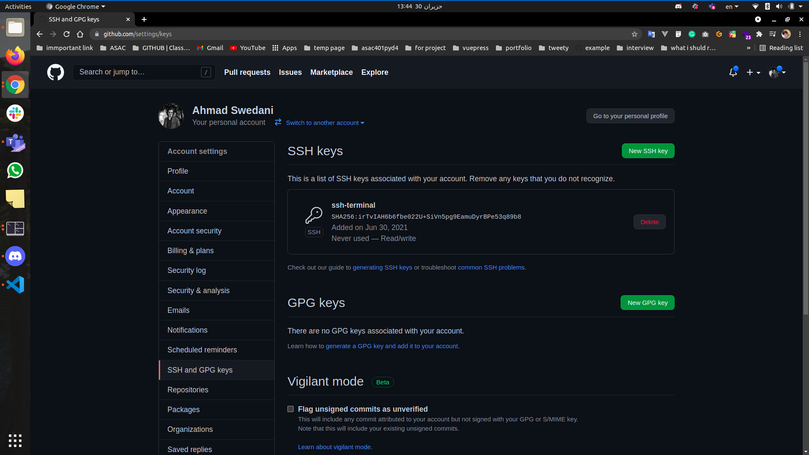

# SSH-GitHub

## setup SSH keys


### Terminal part:

1- First open the terminal:


<!-- 2- Change the directory to ssh using this command:

``` 
sudo apt install openssh-client && cd ~/.ssh
```
 -->

2- Create new SSH key using this command and press enter three times

```
ssh-keygen -t rsa -f github_rsa
```


3- open the "github_rsa.pub" with `cat` by this command and copy the key

```
cat github_rsa.pub
```


### GitHub part:

1- open [GitHub setting Keys](https://github.com/settings/keys)


2- click on `New SSH key` you will see this result:


3- write `ssh-terminal` in the title section

4- paste the key that we copied before in the Key section


5- click on `Add SSH key` you will see this result: 



--- 

### Enjoy using SSH no password any more 😎 🥳:

> clone with SSH URL 

---

### `Important`: to change the remote from Https to SSH:

open your repo and run this command

```
git remote set-url origin SSH-URL
```

### Done